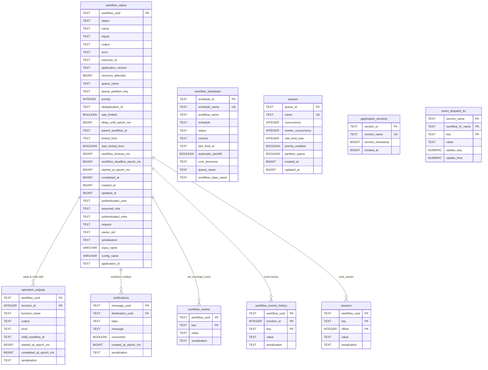

# The DBOS database schema

DBOS keeps all of its durable state in the database (Postgres, or SQLite for
local use). If a process dies partway through a workflow, everything needed to
resume it lives in these tables, so it's worth knowing how they fit together.

There are ten tables, built up over the 37 migrations in
[`migrations/`](../migrations). The layout matches the Go and Python SDKs
column-for-column, which is what lets a workflow written by one SDK be read or
recovered by another.

Most of it revolves around a single table, `workflow_status`, which has one row
per workflow run. The tables that record side effects (steps, messages, events,
streams) all point back at it and are deleted along with it. A few others
(schedules, queues, versions) stand on their own.

One convention to note up front: every timestamp is stored as milliseconds since
the epoch in a plain `BIGINT`, never a SQL `timestamp`. That keeps the on-disk
bytes identical across every language's SDK.

## How the tables relate



The last four tables in the diagram (`workflow_schedules`, `queues`,
`application_versions`, `event_dispatch_kv`) have no foreign key to
`workflow_status`, so they show up unconnected. They're registries and
bookkeeping that outlive any single run.

## workflow_status

The central table. There's one row per workflow run, written before the
workflow starts and updated as it goes, and it's the thing recovery reads to
find work that didn't finish.

It has a lot of columns because it carries everything the engine, the queues,
and the management APIs need. Grouped by what they're for:

| Group | Columns |
|---|---|
| Identity and lineage | `workflow_uuid` (primary key), `name`, `class_name`, `config_name`, `parent_workflow_id`, `forked_from`, `was_forked_from` |
| Execution state | `status`, `executor_id`, `recovery_attempts`, `owner_xid`, `application_version`, `application_id` |
| Input and output | `inputs`, `output`, `error`, `serialization` |
| Queueing | `queue_name`, `queue_partition_key`, `priority`, `deduplication_id`, `rate_limited`, `delay_until_epoch_ms` |
| Timing | `created_at`, `updated_at`, `started_at_epoch_ms`, `completed_at`, `workflow_timeout_ms`, `workflow_deadline_epoch_ms` |
| Auth and context | `authenticated_user`, `assumed_role`, `authenticated_roles`, `request` |

A run moves through a small set of states:

```
ENQUEUED → DELAYED → PENDING → SUCCESS | ERROR | CANCELLED | MAX_RECOVERY_ATTEMPTS_EXCEEDED
```

One bit of history that can trip you up: there used to be a unique constraint on
`(queue_name, deduplication_id)`, but migration 28 replaced it with a partial
index (migration 27). So deduplication now only applies to rows that are still
active, not to completed ones.

## The tables that hang off it

These five each have a foreign key back to `workflow_status` and are deleted
with it (`ON DELETE CASCADE`). That's why deleting a workflow cleans up all of
its history in one statement.

**`operation_outputs`** is the important one — it's where steps are
checkpointed. Each row is one step or one child-workflow call, keyed by
`(workflow_uuid, function_id)`, holding either the step's recorded output/error
or the id of a child workflow it started. This is what replay reads to skip work
that already ran, and it's how step introspection and child lineage are tracked.

**`notifications`** is the mailbox behind `send`/`recv`. Rows are messages
addressed to a workflow on a topic, with a `consumed` flag. An insert trigger
fires a Postgres `NOTIFY` on `dbos_notifications_channel`, so a workflow blocked
in `recv` wakes up immediately instead of polling.

**`workflow_events`** holds `set_event`/`get_event` values, keyed by
`(workflow_uuid, key)`, with its own `NOTIFY` trigger on
`dbos_workflow_events_channel`. **`workflow_events_history`** keeps the versioned
history of those events, keyed by `(workflow_uuid, function_id, key)` so replay
is deterministic.

**`streams`** backs `write_stream`: an append-only log keyed by
`(workflow_uuid, key, offset)`. Closing a stream writes a sentinel row
(`__DBOS_STREAM_CLOSED__`) rather than deleting anything.

## The standalone tables

These don't reference `workflow_status` because they're configuration and
registries, not per-run state.

**`workflow_schedules`** holds cron definitions — the `schedule` string, its
`status` (`ACTIVE`/`PAUSED`), the serialized `context`, plus `last_fired_at`,
`automatic_backfill`, `cron_timezone`, and an optional `queue_name`. The
scheduler reads this table to decide what to run.

**`queues`** is a registry of declared queues and their limits (`concurrency`,
`worker_concurrency`, `rate_limit_max`, `priority_enabled`, `partition_queue`).
In practice the runtime uses the in-process queue config; this table is mostly
informational, the same as in the Go SDK.

**`application_versions`** records deployed versions, so recovery can be gated to
the version that produced a row.

**`event_dispatch_kv`** is bookkeeping for exactly-once handling of external
event sources (for example Kafka), keyed by
`(service_name, workflow_fn_name, key)`.

## A few things worth knowing

The whole design leans on one idea: **anything durable is a row with a
deterministic key, written idempotently.** Steps, events, sends, stream writes,
and schedule fires are all "insert if it isn't already there, otherwise read
back what's there." That's what makes replay and crash recovery work without any
in-memory state being the source of truth.

The **`serialization` column** (added to every payload table in migration 11)
records how a value was encoded — `DBOS_JSON`, `portable_json`, or `DBOS_GOB`.
Because it travels with the data, an SDK in one language can decode rows written
by another.

**Cascade deletes** from `workflow_status` mean one delete cleans up a
workflow's steps, events, streams, and messages together.

On Postgres, the **`LISTEN`/`NOTIFY` triggers** on `notifications` and
`workflow_events` turn polling into push, so blocked `recv`/`get_event` calls
wake promptly. SQLite doesn't have that, so it polls instead.

Finally, a lot of the later migrations (roughly 22 through 37) just drop full
indexes and recreate them as **partial indexes** scoped to the rows the
dispatcher actually scans — pending, failed, in-flight. It keeps the hot path
cheap as the table grows.

---

*Generated from the migrations in [`migrations/postgres`](../migrations/postgres);
SQLite uses the same shape with SQLite-native types.*
